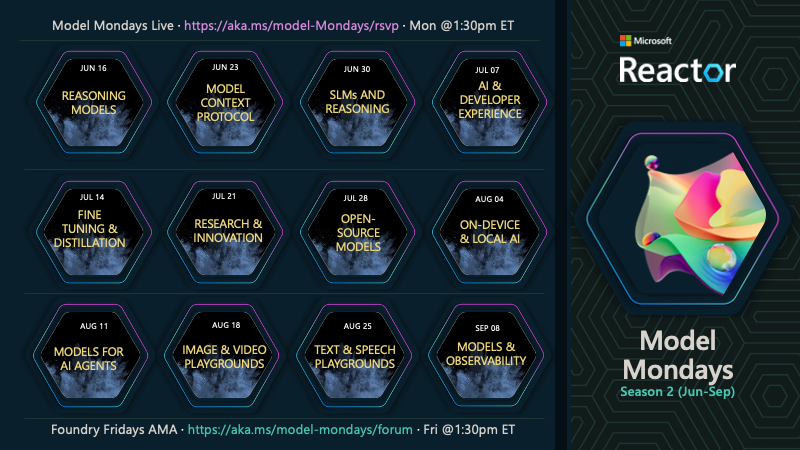

# Model Mondays: Build Your Model IQ

Model Mondays is a weekly 30-min livestream (on Mondays) with an AMA session (on Fridays) to help you keep up with the rapid pace of innovation in AI models.

- **Highlights** · a 5-min recap of top model news from the last week.
- **Spotlight** · a 15-min deep dive into a single model, with an expert.
- **Community** · a 30-min AMA for interactive QA with experts, on Discord.

---

## S2E01 · Advanced Reasoning 🌟 **THIS WEEK**

> 🚨 **[Watch The Replay Now](https://youtu.be/ffxUEenM4B8)**

> Want to learn advanced techniques to improve AI's reasoning and problem-solving skills, enabling smarter and more efficient decision-making? Join us as we talk to Marlene Mhangami about her work building a Deep Researcher using Deep Seek R1 and LangChain. 

 - 1️⃣ | [Register For The Livestream](https://developer.microsoft.com/en-us/reactor/events/25905/) - Monday, Jun 16
 - 2️⃣ | [Register For The AMA](https://discord.gg/azureaifoundry?event=1382860017660854372) - Friday, Jun 20
 - 3️⃣ | [Ask Questions & View Recaps](https://github.com/orgs/azure-ai-foundry/discussions/55) - Discussion Forum

---

## S2E02 · Model Context Protocol 🌟 **NEXT WEEK**

> Want to learn how Model Context Protocol works and how to leverage MCP in a more effective way to extend the capabilities of your AI models and agents? Join us as we talk to Den Delimarsky about the MCP specification, security considerations and usage within Microsoft Azure. 

 - 1️⃣ | [Register For The Livestream](https://developer.microsoft.com/en-us/reactor/events/25906/) - Monday, Jun 23
 - 2️⃣ | [Register For The AMA](https://discord.gg/azureaifoundry?event=1382860621137317948) - Friday, Jun 30
 - 3️⃣ | [Ask Questions & View Recaps](https://github.com/orgs/azure-ai-foundry/discussions/54) - Discussion Forum

  

## 👉🏽👉🏽 Join The Community

Great devs don't build alone! In a fast-pased developer ecosystem, there's no time to hunt for help. That's why we have the Azure AI Developer Community. Join us today and let's journey together!

1. [Join the Discord](https://aka.ms/model-mondays/discord) - for real-time chats, events & learning
1. [Explore the Forum](https://aka.ms/model-mondays/forum) - for AMA recaps, Q&A, and help!

---

## 👉🏽👉🏽 Season 2: Live on Mondays, AMA on Fridays!

Season 2 will be a 12-episode series with our focus now expanding to models and model-related tooling - with a focus on both industry (adoption) and research (innovation). Here's a sneak peek at the topics we have planned! 

> [!IMPORTANT]  
> Registrations are open for both livestreams and AMAs. **Click the date for registration links**. Check the table below for updates - and [visit the Season 2](./docs/season-02/README.md) pages for more details _or scroll down to see the current and next episodes on the schedule_.

| Episode | Topic  | Live | AMA | Recap | PDF | Speaker(s)| 
|:---|:---|:---|:---|:---|:---|:---|
| E01 | Advanced Reasoning | [Play ▶️](https://youtu.be/ffxUEenM4B8) | [Jun 20](https://discord.gg/azureaifoundry?event=1382860017660854372) | [Forum](https://github.com/orgs/azure-ai-foundry/discussions/55) | [Slides](https://speakerdeck.com/nitya/model-mondays-s2e01-advanced-reasoning) | Marlene Mhangami |
| E02 |  Model Context Protocol| [Jun 23](https://developer.microsoft.com/en-us/reactor/events/25906/) | [Jun 27](https://discord.gg/azureaifoundry?event=1382860621137317948) | -| -| Den Delimarsky |
| E03 | SLMs and Reasoning | [Jun 30](https://developer.microsoft.com/en-us/reactor/events/25907/) | [Jul 03](https://discord.gg/azureaifoundry?event=1382861149288005693) |-| - | Mojan Javaheripi, PhD |
| E04 | AI & Developer Experience | |  | - | - | |
| E05 | Fine-Tuning & Distillation | |  | - | - | |
| E06 | Research & Innovation | |  | - | - | |
| E07 | Open-Source Models | |  | - | - | |
| E08 | On-Device & Local AI | |  | - | - | |
| E09 | Models for AI Agents | |  | - | - | |
| E10 | Image & Video Playgrounds| |  | - | - | |
| E11 | Text & Speech Playgrounds | |  | - | - | |
| E12 | Models & Observability | |  | - | - | |
| | | | | | |

  

## 👉🏽👉🏽 Season 1: Watch The Replays

Each episode puts the spotlight on a single model or model-related tool. Learn  Click the links to watch the replays - and [visit the Season 1 page](./docs/season-01/README.md) for episode details.

| Episode | Stream | Video | Blog | Slides | AMA | 
|:---|:---|:---|:---|:---|:---|
| E01 · GitHub Models | Mar 10 | [**Play ▶️**](https://developer.microsoft.com/reactor/events/25265/)| [GitHub Models](https://techcommunity.microsoft.com/blog/machinelearningblog/introducing-model-mondays-%E2%80%93-your-ai-model-power-up/4390773) | [PDF](https://speakerdeck.com/nitya/model-mondays-s1-e1-mar-10-2025)  | Mar 14  |
| E02 ·  Reasoning Models| Mar 17 | [**Play ▶️**](https://developer.microsoft.com/reactor/events/25266/) | [OpenAI, DeepSeek](./docs/season-01/ep-02.md)| [PDF](https://speakerdeck.com/nitya/model-mondays-s1-e2-hands-on-with-reasoning-models) | Mar 21 | 
| E03 ·  Search + Retrieval | Mar 24 |  [**Play ▶️**](https://developer.microsoft.com/en-us/reactor/events/25354/) |[Cohere Rerank](https://techcommunity.microsoft.com/blog/machinelearningblog/model-mondays-why-rerank-models-are-the-secret-sauce-of-high-quality-search/4396032) | [PDF](https://speakerdeck.com/nitya/model-mondays-s1-e3-hands-on-with-search-and-retrieval-models)  | Mar 28 |
| E04 ·  Visual + Generative | Mar 31 |[**Play ▶️**](https://developer.microsoft.com/reactor/events/25355/) |[Stable Diffusion](https://techcommunity.microsoft.com/blog/machinelearningblog/model-mondays-lights-prompts-action/4398576) |  [PDF](https://speakerdeck.com/nitya/model-mondays-s1-e4-hands-on-with-visual-generative-ai) | Apr 04 |
| E05 ·  Fine-Tuning | Apr 07 |[**Play ▶️**](https://developer.microsoft.com/reactor/events/25356/)  |[Mistral](https://techcommunity.microsoft.com/blog/machinelearningblog/model-mondays-teaching-your-model-new-tricks-with-fine-tuning/4401129) | [PDF](https://speakerdeck.com/nitya/model-mondays-s1-e4-hands-on-with-fine-tuning-models) | Apr 11| |
| E06 ·  Local AI Development | Apr 14 |[**Play ▶️**](https://developer.microsoft.com/reactor/events/25357/)  | [AI Toolkit (AITK)](https://techcommunity.microsoft.com/blog/machinelearningblog/model-mondays-bringing-ai-home-with-local-development/4403619) |  [PDF](https://speakerdeck.com/nitya/model-mondays-s1-e6-hands-on-with-local-ai-development) | Apr 18 |
| E07 ·  Open Source & AI | Apr 21 |[**Play ▶️**](https://developer.microsoft.com/reactor/events/25358/)  | [Llama 4 (Meta)](https://techcommunity.microsoft.com/blog/aiplatformblog/expanding-the-llama-4-herd-new-models-now-available-on-azure-ai-foundry/4403609)| [PDF](https://speakerdeck.com/nitya/model-mondays-s1-e7-hands-on-with-open-source-models) | Apr 25|
| E08 ·  Forecasting Models | Apr 28 |[**Play ▶️**](https://developer.microsoft.com/reactor/events/25359/)  | Nixtla TimeGEN | - | May 02 |
| | |

 
