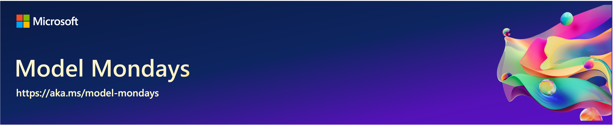
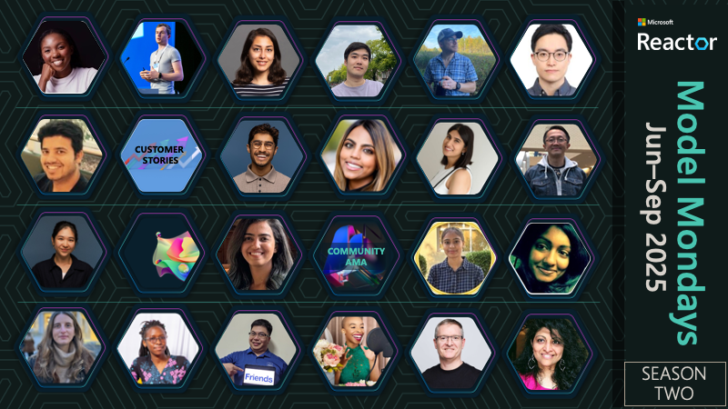
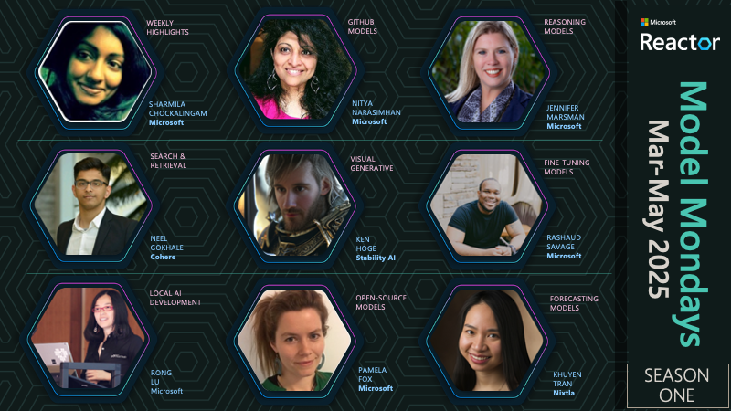

# Model Mondays: Build Your Model IQ

     

> 🌟 If you find this series useful, give us a star on GitHub!.

---

 

Every AI developer journey starts with model choice. But, as developers, we face two challenges. First is **information overload** - how do we keep up with the rapid pace of model updates and innovation? Second is **decision fatigue** - how do we pick the right model for our task given an ever-growing list of options? Model Mondays tackles these challenges by helping you build your model IQ one week at a time with [livestreams every Monday](https://aka.ms/model-mondays/rsvp) and [AMAs every Friday](https://aka.ms/model-mondays/forum).

1. **5-min Highlights** - catch up on key news items from the past week.
2. **15-min Spotlight** - get a deep-dive on 1 topic from an expert.
3. **30-min AMA** - ask questions & discuss topic with experts on Discord.

 

## Season 2: Jun-Sep 2025

> _Season 2 kicked off on Jun 16, 2025 and will run through Sep 2025. =Use the **Register** links to get reminders for upcoming events, and visit the **Replay** and **Recap** links to revisit past episodes and AMAs._

| Episode | Topic | Monday Livestream | Friday AMA| Slides | Blog |
|:---|:---|:---|:---|:---|:---|
| S2:E01 | Advanced Reasoning |  |  | | |
| S2:E02 | Model Context Protocol|  |  | ||
| S2:E03| SLMs and Reasoning |  |  | ||
| S2:E04| AI & Dev Experience |  |  | ||
| S2:E05| Fine-Tuning & Distillation |  |  | | 
| | **`REGISTER NOW👇🏽`** | |
| S2:E06| Research & Innovation |  |  | |
| S2:E07| AI Assisted Development |  |  | |
| S2:E08| On-Device & Local AI |  |  | |
| S2:E09| Models for AI Agents |  |  | |
| S2:E10| Image & Video Playground |  |  | |
| S2:E11| Text & Speech Playground |  |  | |
| S2:E12| Models & Observability |  |  | |
| | | |

> **Want to get more details about each session? [Check out the Season 2 page](./docs/season-02/README.md) for more information on each session including speakers, description and links to recaps and slides.** 

---

 

## Season 1: Mar-May 2025

 
 
 
 
 
  
 
 

> **Our pilot season featured 8 episodes covering models (green badges) and tools (magenta badges) in Azure AI Foundry. [Visit the Season 1 page](./docs/season-01/README.md) for details or click the episode specific badge below to go directly to the replay.**

| Episode | Video | Blog | Slides | AMA | 
|:---|:---|:---|:---|:---|
| E01 · GitHub Models | [**Play ▶️**](https://developer.microsoft.com/reactor/events/25265/)| [GitHub Models](https://techcommunity.microsoft.com/blog/machinelearningblog/introducing-model-mondays-%E2%80%93-your-ai-model-power-up/4390773) | [PDF](https://speakerdeck.com/nitya/model-mondays-s1-e1-mar-10-2025)  | Mar 14  |
| E02 ·  Reasoning Models | [**Play ▶️**](https://developer.microsoft.com/reactor/events/25266/) | [OpenAI, DeepSeek](./docs/season-01/ep-02.md)| [PDF](https://speakerdeck.com/nitya/model-mondays-s1-e2-hands-on-with-reasoning-models) | Mar 21 | 
| E03 ·  Search + Retrieval  |  [**Play ▶️**](https://developer.microsoft.com/en-us/reactor/events/25354/) |[Cohere Rerank](https://techcommunity.microsoft.com/blog/machinelearningblog/model-mondays-why-rerank-models-are-the-secret-sauce-of-high-quality-search/4396032) | [PDF](https://speakerdeck.com/nitya/model-mondays-s1-e3-hands-on-with-search-and-retrieval-models)  | Mar 28 |
| E04 ·  Visual + Generative  |[**Play ▶️**](https://developer.microsoft.com/reactor/events/25355/) |[Stable Diffusion](https://techcommunity.microsoft.com/blog/machinelearningblog/model-mondays-lights-prompts-action/4398576) |  [PDF](https://speakerdeck.com/nitya/model-mondays-s1-e4-hands-on-with-visual-generative-ai) | Apr 04 |
| E05 ·  Fine-Tuning  |[**Play ▶️**](https://developer.microsoft.com/reactor/events/25356/)  |[Mistral](https://techcommunity.microsoft.com/blog/machinelearningblog/model-mondays-teaching-your-model-new-tricks-with-fine-tuning/4401129) | [PDF](https://speakerdeck.com/nitya/model-mondays-s1-e4-hands-on-with-fine-tuning-models) | Apr 11| |
| E06 ·  Local AI Development |[**Play ▶️**](https://developer.microsoft.com/reactor/events/25357/)  | [AI Toolkit (AITK)](https://techcommunity.microsoft.com/blog/machinelearningblog/model-mondays-bringing-ai-home-with-local-development/4403619) |  [PDF](https://speakerdeck.com/nitya/model-mondays-s1-e6-hands-on-with-local-ai-development) | Apr 18 |
| E07 ·  Open Source & AI  |[**Play ▶️**](https://developer.microsoft.com/reactor/events/25358/)  | [Llama 4 (Meta)](https://techcommunity.microsoft.com/blog/aiplatformblog/expanding-the-llama-4-herd-new-models-now-available-on-azure-ai-foundry/4403609)| [PDF](https://speakerdeck.com/nitya/model-mondays-s1-e7-hands-on-with-open-source-models) | Apr 25|
| E08 ·  Forecasting Models |[**Play ▶️**](https://developer.microsoft.com/reactor/events/25359/)  | Nixtla TimeGEN | - | May 02 |
| | |

 

## 👉🏽👉🏽 Join The Community

Great devs don't build alone! In a fast-pased developer ecosystem, there's no time to hunt for help. That's why we have the Azure AI Developer Community. Join us today and let's journey together!

1. [Join the Discord](https://aka.ms/model-mondays/discord) - for real-time chats, events & learning
1. [Explore the Forum](https://aka.ms/model-mondays/forum) - for AMA recaps, Q&A, and help!

 
