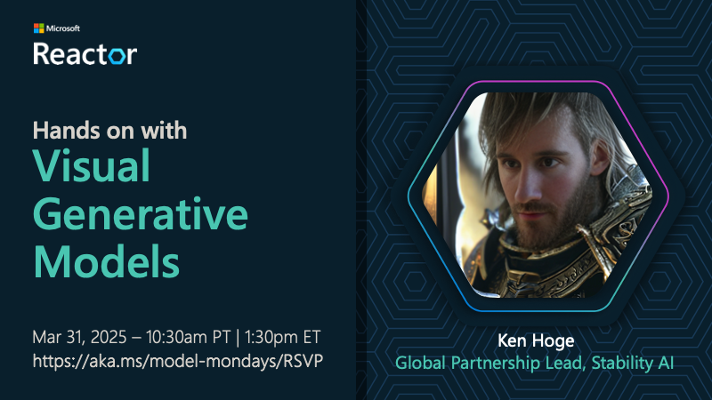
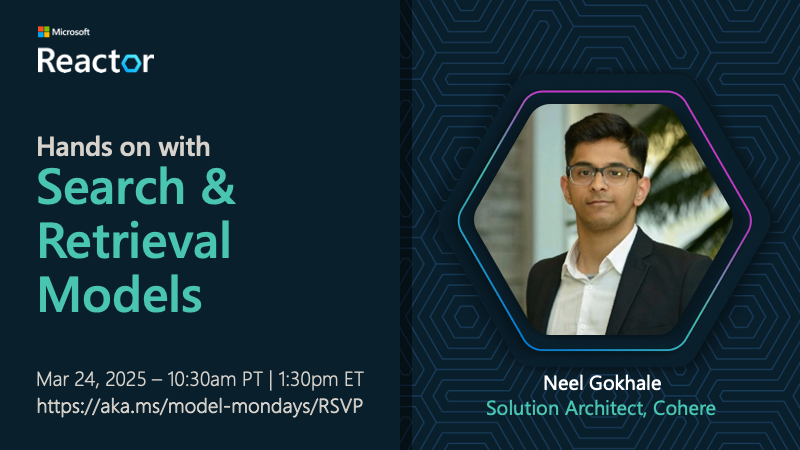

# Model Mondays: Build Your Model IQ

Model Mondays is a weekly 30-min livestream (on Mondays) with an AMA session (on Fridays) to help you keep up with the rapid pace of innovation in AI models.

- **Highlights** · a 5-min recap of top model news from the last week.
- **Spotlight** · a 15-min deep dive into a single model, with an expert.
- **Community** · a 30-min AMA for interactive QA with experts, on Discord.

Join us, and take action to build your model IQ one week at a time!

 

## New Episode · Mar 31, 2025

- **[Click here](https://youtu.be/Qs4fdy17b40?list=PLmsFUfdnGr3wzz6a4E-Szksg92JPng-AL) to register for livestream on Monday, Mar 31**
- **[Click here](https://aka.ms/model-mondays/chat) to register for the AMA on Friday, Apr 04**

 

## Season 1: Schedule

> [!IMPORTANT]  
> 1. [Join our Discord](https://aka.ms/model-mondays/discord) · Watch the #model-mondays channel for updates!
> 2. [Register for Livestream](https://aka.ms/model-mondays/RSVP) · Watch live every Monday @1:30pm ET.
> 3. [Register for AMA](https://aka.ms/model-mondays/chat) · Join us for interactive QA every Friday @1:30pm ET.

| Episode | Live | Video | Details Page | Resources | AMA |
|:---|:---|:---|:---|:---|:---|
| E01 · GitHub Models | Mar 10 | [**Replay**](https://developer.microsoft.com/reactor/events/25265/)| [GitHub Models](./docs/season-01/ep-01.md) | [PDF](https://speakerdeck.com/nitya/model-mondays-s1-e1-mar-10-2025)  | Mar 14  |
| E02 ·  Reasoning Models| Mar 17 | [**Replay**](https://developer.microsoft.com/en-us/reactor/events/25266/) | [OpenAI, DeepSeek](./docs/season-01/ep-02.md)| [PDF](https://speakerdeck.com/nitya/model-mondays-s1-e2-hands-on-with-reasoning-models) · [Code](./labs/season-01/reasoning-models/README.md) | Mar 21 |
| E03 ·  Search + Retrieval | Mar 24 |  [**Replay**](https://developer.microsoft.com/en-us/reactor/events/25354/) |[Cohere Rerank](./docs/season-01/ep-03.md) | [PDF](https://speakerdeck.com/nitya/model-mondays-s1-e3-hands-on-with-search-and-retrieval-models)  | Mar 28 |
| E04 ·  Visual + Generative | Mar 31 |[**RSVP 🪧**](https://developer.microsoft.com/en-us/reactor/events/25355/) |[Stable Diffusion](./docs/season-01/ep-04.md) |  - | [Apr 03](https://aka.ms/model-mondays/chat) 🎙️ |
| E05 ·  Fine-Tuning | Apr 07 |[**RSVP 🪧**](https://developer.microsoft.com/en-us/reactor/events/25356/)  |[Mistral](./docs/season-01/ep-05.md) | - |  Apr 10 |
| E06 ·  Synthetic Datasets | Apr 14 |[**RSVP 🪧**](https://developer.microsoft.com/en-us/reactor/events/25357/)  |[TBA](./docs/season-01/ep-06.md) | - |Apr 17 |
| E07 ·  Open Source | Apr 21 |[**RSVP 🪧**](https://developer.microsoft.com/en-us/reactor/events/25358/)  |[TBA](./docs/season-01/ep-07.md) | - | Apr 21 |
| E08 ·  Forecasting Models | Apr 28 |[**RSVP 🪧**](https://developer.microsoft.com/en-us/reactor/events/25359/)  |[Nixtla TimeGEN](./docs/season-01/ep-08.md) | - | Apr 28 |

 

## S1E03: Cohere Rerank v3.5

> **[Click here](https://www.youtube.com/watch?v=Qs4fdy17b40L) to watch the replay**

In this episode, we are joined by Neel Gokhale from Cohere. Find out how reranking improves relevance of search results for Retrieval Augmented Generation, and see a hands-on demo with the Cohere Rerank v3.5 model.

 

## S1E02: OpenAI o1 series

> **[Click here](https://youtu.be/nTqr4pzxF-k?list=PLmsFUfdnGr3wzz6a4E-Szksg92JPng-AL) to watch the replay**

In this episode, we are joined by Jennifer Marsman from Microsoft. Find out what reasoning models are, and why they are taking the AI world by storm. See a hands-on demo with the OpenAI o1 model and a real-world use case.

 

## S1E01: GitHub Models

> **[Click here](https://www.youtube.com/watch?v=dohvGc7eyqU&list=PLmsFUfdnGr3wzz6a4E-Szksg92JPng-AL&index=3&pp=iAQB) to watch the replay**

In this episode, we are joined by Nitya Narasimhan from Microsoft. Find out what GitHub Models are and how they can help you jumpstart your generative AI learning journey for free, with just your GitHub account. Make GitHub Models your AI learning sandbox!

 

 

## Contributing

This project welcomes contributions and suggestions.  Most contributions require you to agree to a
Contributor License Agreement (CLA) declaring that you have the right to, and actually do, grant us
the rights to use your contribution. For details, visit https://cla.opensource.microsoft.com.

When you submit a pull request, a CLA bot will automatically determine whether you need to provide
a CLA and decorate the PR appropriately (e.g., status check, comment). Simply follow the instructions
provided by the bot. You will only need to do this once across all repos using our CLA.

This project has adopted the [Microsoft Open Source Code of Conduct](https://opensource.microsoft.com/codeofconduct/).
For more information see the [Code of Conduct FAQ](https://opensource.microsoft.com/codeofconduct/faq/) or
contact [opencode@microsoft.com](mailto:opencode@microsoft.com) with any additional questions or comments.

## Trademarks

This project may contain trademarks or logos for projects, products, or services. Authorized use of Microsoft 
trademarks or logos is subject to and must follow 
[Microsoft's Trademark & Brand Guidelines](https://www.microsoft.com/en-us/legal/intellectualproperty/trademarks/usage/general).
Use of Microsoft trademarks or logos in modified versions of this project must not cause confusion or imply Microsoft sponsorship.
Any use of third-party trademarks or logos are subject to those third-party's policies.
