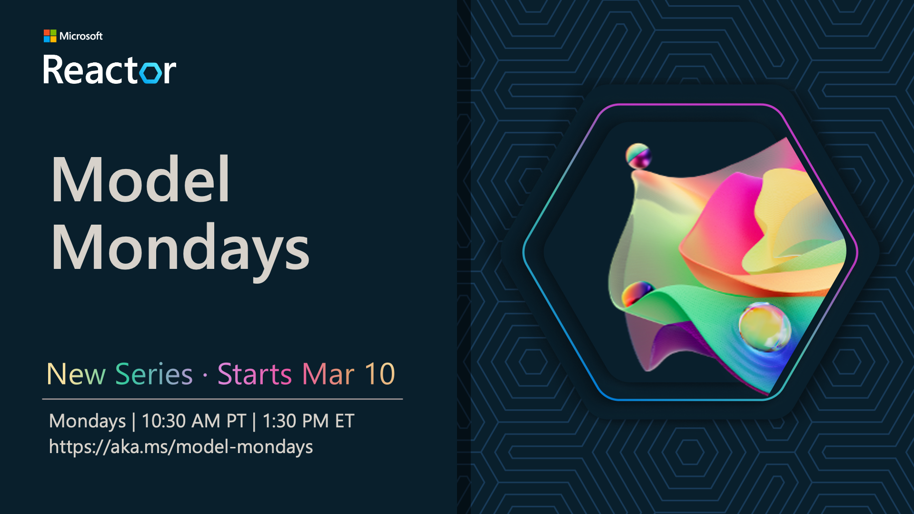

# Model Mondays: Build Your Model IQ

Welcome to Model Mondays - a weekly 30-minute livestream series that helps you keep track of the fast-paced growth of the AI models ecosystem in actionable ways.

- **Model Roundup** - Catch up on a week's worth of model news in 5 minutes
- **Model Spotlight** - Get a deep dive into one featured model each week
- **Community Chat** - Bring your questions and insights to office hours on Discord!

> [!IMPORTANT]  
> [Register here and join us live](https://aka.ms/model-mondays/RSVP)!  
> Model Mondays will be livestreamed every Monday from 1:30pm-2:00pm EST on Microsoft Reactor! Season 1 kicks off on March 10 with 8 episodes planned for the first run. 

> [!IMPORTANT]  
> [Join our Discord!](https://aka.ms/model-mondays/discord)  
> Model Mondays office hours will be held on Azure AI Discord every Friday 1:30pm-2:00pm EST. You can also join the #model-mondays channel for discussions at any time!

---

## Episode 1: Replay 🆕

> **Click to watch the latest episode**

Model Mondays is a weekly 30-minute livestream series that helps you keep track of the fast-paced growth of the AI models ecosystem in actionable ways. Every episode is structured in three parts:

- **Model Highlights** - We roundup a week's worth of news in 5 minutes!
- **Model Spotlight** - We dive deeper into one featured model a week!
- **Community Chat** - Join us for office hours on Discord!

---

## Season 1: Schedule

> **Join us for Model Mondays every Monday at 10:30pm PST / 1:30pm EST. It's a weekly show where we round up the latest AI model news and put one model in the spotlight for a deeper dive. Let's Build our model IQ!**

| Episode Page | Date | Video | Details | Resources | Office Hours |
|:---|:---|:---|:---|:---|:---|
| #01 - GitHub Models | [Mar 10](https://developer.microsoft.com/en-us/reactor/events/25265/) | [**Watch Now**](https://youtu.be/dohvGc7eyqU)| [GitHub Models](./docs/season-01/ep-01.md) | [PDF](https://speakerdeck.com/nitya/model-mondays-s1-e1-mar-10-2025) · Code | [Mar 14](https://aka.ms/model-mondays/chat) |
| #02 - Reasoning Models| Mar 17 | [**RSVP Now**](https://developer.microsoft.com/en-us/reactor/events/25266/) | [OpenAI, DeepSeek](./docs/season-01/ep-02.md)| - | [Mar 21](https://aka.ms/model-mondays/chat) |
| #03 - Search & Retrieval | Mar 24 |  [**RSVP Now**](https://developer.microsoft.com/en-us/reactor/events/25354/) |[Cohere Rerank](./docs/season-01/ep-03.md) | - | [Mar 28](https://aka.ms/model-mondays/chat) |
| #04 - Visual Generative AI | Mar 31 |[**RSVP Now**](https://developer.microsoft.com/en-us/reactor/events/25355/) |[Stable Diffusion](./docs/season-01/ep-04.md) |  - | [Apr 03](https://aka.ms/model-mondays/chat) |
| #05 - Fine-Tuning Models | Apr 07 |[**RSVP Now**](https://developer.microsoft.com/en-us/reactor/events/25356/)  |[TBA](./docs/season-01/ep-05.md) | - |  [Apr 10](https://aka.ms/model-mondays/chat) |
| #06 - Synthetic Datasets | Apr 14 |[**RSVP Now**](https://developer.microsoft.com/en-us/reactor/events/25357/)  |[TBA](./docs/season-01/ep-06.md) | - | [Apr 17](https://aka.ms/model-mondays/chat) |
| #07 - Open Source Projects | Apr 21 |[**RSVP Now**](https://developer.microsoft.com/en-us/reactor/events/25358/)  |[TBA](./docs/season-01/ep-07.md) | - | [Apr 21](https://aka.ms/model-mondays/chat) |
| #08 - Forecasting Models | Apr 28 |[**RSVP Now**](https://developer.microsoft.com/en-us/reactor/events/25359/)  |[Nixtla TimeGEN](./docs/season-01/ep-08.md) | - | [Apr 28](https://aka.ms/model-mondays/chat) |

---

## Contributing

This project welcomes contributions and suggestions.  Most contributions require you to agree to a
Contributor License Agreement (CLA) declaring that you have the right to, and actually do, grant us
the rights to use your contribution. For details, visit https://cla.opensource.microsoft.com.

When you submit a pull request, a CLA bot will automatically determine whether you need to provide
a CLA and decorate the PR appropriately (e.g., status check, comment). Simply follow the instructions
provided by the bot. You will only need to do this once across all repos using our CLA.

This project has adopted the [Microsoft Open Source Code of Conduct](https://opensource.microsoft.com/codeofconduct/).
For more information see the [Code of Conduct FAQ](https://opensource.microsoft.com/codeofconduct/faq/) or
contact [opencode@microsoft.com](mailto:opencode@microsoft.com) with any additional questions or comments.

## Trademarks

This project may contain trademarks or logos for projects, products, or services. Authorized use of Microsoft 
trademarks or logos is subject to and must follow 
[Microsoft's Trademark & Brand Guidelines](https://www.microsoft.com/en-us/legal/intellectualproperty/trademarks/usage/general).
Use of Microsoft trademarks or logos in modified versions of this project must not cause confusion or imply Microsoft sponsorship.
Any use of third-party trademarks or logos are subject to those third-party's policies.
