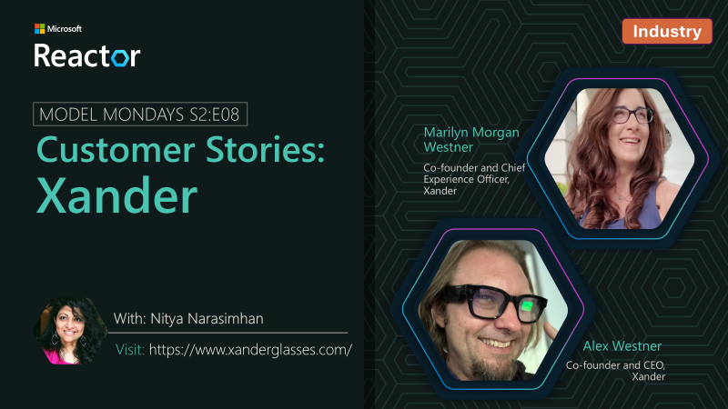

## Customer Stories
As part of Model Mondays, we feature real world customer stories showing how Azure AI Foundry models are solving enterprise problems. 

### Jul 21st 2025: Capacity

We're joined by Steve Frederickson, Head of Product and Zachary Meierhoffer, Product Manager at Capacity, who walk through how Capacity's Answer Engine uses Azure AI Foundry models to unlock insights from knowledge that exists across their organizations.

**Speakers:**

_Steve Frederickson_ is Head of Product for Capacity’s Answer Engine, where he leads the strategy and development of AI-powered knowledge solutions. A serial entrepreneur and product innovator, Steve has pioneered Generative AI capabilities since 2021 to reshape how organizations access and use information.

_Zachary Meierhofer_ is a product manager with a passion for turning complex AI into intuitive solutions. At Capacity, he builds tools that help teams access knowledge instantly and deliver smarter support. With over a decade of experience in AI and search, he blends technical depth with a strong focus on user impact.  

### Jul 28th 2025: SightMachine

In this new segment, we continue talking to customers about real world usage of Azure AI technologies and solutions. In this episode we're joined by Kurt DeMaagd, Chief AI Officer at SightMachine!.

**Speakers:**

_Kurt DeMaagd_ is is Chief AI Officer and Co-founder at Sight Machine. He has developed AI agents and ML applications for manufacturing predictive maintenance, prescriptive energy optimization and waste reduction, decision support tools for quality, and schedule optimization. Kurt has presented on manufacturing AI/ML at conferences such as the Microsoft Ignite, NVIDIA GTC, Qatar Economic Forum, Automate, the American Society for Quality, multiple presentations at the ASQ Statistic Division conference, plus 30+ academic publications. Previously, Kurt was a professor at Michigan State University. He has a Ph.D. in Business Administration from the University of Michigan, Ross School of Business; and a BS in Computer Science from Hope College.

### Aug 04th 2025: Xander

In this new segment, we talk to customers about real world usage of Azure AI technologies and solutions. In this episode we're joined by Marilyn Morgan Westner, Co-founder and Chief Experience Officer, and Alex Westner, Co-founder and CEO at Xander!.

**Speakers:**

_Marilyn Morgan Westner_ is is Chief Experience Officer (CXO) and Co-founder at Xander. As a researcher and educator in language and history, Marilyn earned a Ph.D. in history, focusing on underrepresented groups, culture, and technology. She spent 14 years working with older adults and their families, capturing stories, curating collections, and lecturing at Harvard University and UMass. She spent six years as a research associate at Harvard Business School, writing case studies about entrepreneurship, frontier tech, and corporate trust, and she co-created two new elective courses. Her work has appeared in the Harvard Business Review, Harvard Business Publishing, Founder’s Journey, the Journal of Popular Culture, and several academic book collections.

_Alex Westner_ is is Chief Executive Officer (CEO) and Co-founder at Xander. Alex spent 20+ years leading product strategy at iZotope, Gibson, and Fidelity Labs, Fidelity Investments' innovation incubator. He began his career in engineering, focused on microphone arrays and the “cocktail party problem.” At the MIT Media Lab he trained computers to differentiate individual voices from other sounds. He spent 18 years as a product leader in audio and music technology companies, where he developed and shipped software products that analyzed and separated sound and speech. He led several successful audio products including iZotope RX, which won an Engineering Emmy Award. In 2018, he became a product leader at Fidelity Labs. Working in fintech, he gained experience protecting online privacy and led a team that successfully developed and launched a software platform that helped financial advisors introduce sustainable investing practices to their clients.

---
