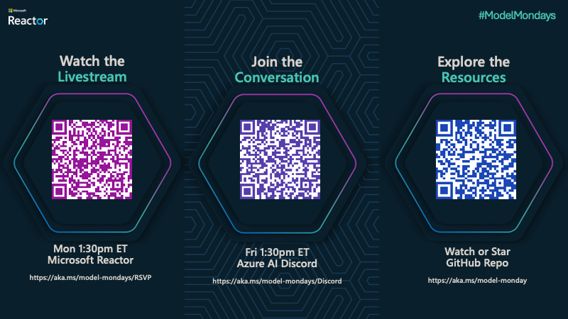

---
date:
  created: 2025-03-03
pin: false
draft: false
authors: 
  - nitya
categories:
  - Season-01
tags:
  - general
---

# Welcome to Model Mondays!

Model Mondays is a [weekly livestream](https://aka.ms/model-mondays/rsvp) to help you build your AI Model IQ - with follow-up [office hours](https://aka.ms/model-mondays/chat) every Friday for Q&A and discussions. Read on to learn why we decided to do this series, and what Season 1 will involve.

<!-- more -->

## Motivation

The [Future of AI lies in Model Choice](https://techcommunity.microsoft.com/blog/aiplatformblog/the-future-of-ai-is-model-choice---from-structured-process-to-seamless-platform/4284091). Two years ago, we had a handful of large language models to choose from. Now, we face the paradox of choice!

- The [Azure AI Foundry model catalog](https://ai.azure.com/explore/models) gives us 1800+ model options.
- The [Hugging Face Hub](https://huggingface.co/hub) has 1.5M+ community-generated open-source variants. 

We also have a growing number of tools and workflows to help us _customize_ models after selection with prompt engineering, fine tuning, RAG and more. This raises two challenges:

- **Information Fatigue** - how do we keep up with the latest model tech and announcements?
- **Decision Fatigue** - how do we make informed decisions when selecting an AI model?

## Model Mondays

Model Mondays is a weekly livestreamed 30-minute show that addresses these issues with two targeted segments.

1. A 5-minute **Highlights** reel - that rounds up the top news from the past week.
1. A 15-minute **Spotlight** segment - where we dive into 1 featured model each week.

The segments are bookended by 5-minute discussion and Q&A with the community, as time permits. However, we encourage viewers to come to [regular Friday office hours](https://aka.ms/model-mondays/chat) to have longer conversations on the topic, and _show and tell_ what they built! 

Plus, check back here for code samples and guidance, to help you explore these further.

## Getting Involved

The first season has a planned set of eight episodes as listed [here](./../../index.md). Visit the [series page](https://aka.ms/model-mondays/rsvp) and register to be notified when when each episode is livestreamed. The spotlight content should be evergreen - so check back on the registration pages for replays anytime.

Ready to jumpstart your AI Adventures? Join us at the next livestream or office hours!

