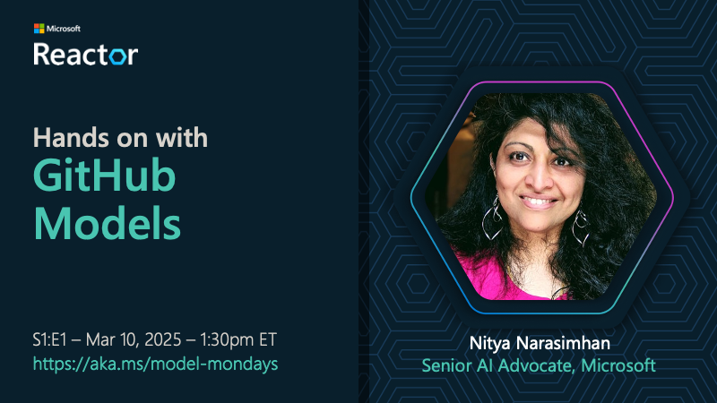

---
date:
  created: 2025-03-10
draft: false
authors: 
  - nitya
categories:
  - Recaps
  - Season-01
tags:
  - github
---

# Hands-on With GitHub Models

It's time to jumpstart your AI model exploration journey! But where can you get started? Most model providers have tiered pricing plans that are beginner-friendly - but what if you could explore popular models **for free**? Let's talk about why you need to take a look at GitHub Models!

<!-- more -->

## Spotlight On: GitHub Models

**Welcome to S1:E1**. In this first episode of Season 1, we put the spotlight on the [GitHub Model Marketplace](https://github.com/marketplace/models) - you access to top-tier language models for hands-on exploration, with just a GitHub account!  

**Here are a few things to keep in mind:**

1. Models are rate-limited by default. They are not meant for production use!
1. Models are deployed as serverless endpoints. Access them on demand, to run requests.
1. Use the Playground feature to test models, and compare them side-by-side.
1. Use the Prompt Editor feature to iterate rapidly from initial prompt, to prototype
1. Try the `Use This Model` feature to go from UI-first to code-first development easily.
1. Try the `Get production key` option to go from prototype (GitHub) to production (Azure).

---

## Watch The Segment

In this spotlight segment, we go through most of these features with interactive demos. Watch the replay below - then try these out on your own, with your personal GitHub account.

!!! info "Click on the banner to watch this spotlight segment"

    

---

## Browse The Slides

Want to get links to the news highlights or featured models? Want to review the spotlight segment at your own pace? You can download the slides or browse them online, at the embedded link below.

<iframe class="speakerdeck-iframe" frameborder="0" src="https://speakerdeck.com/player/7dfabc48029c43d68bd7abf5b998d8fa" title="Model Mondays S1:E1 - Mar 10, 2025" allowfullscreen="true" style="border: 0px; background: padding-box padding-box rgba(0, 0, 0, 0.1); margin: 0px; padding: 0px; border-radius: 6px; box-shadow: rgba(0, 0, 0, 0.2) 0px 5px 40px; width: 100%; height: auto; aspect-ratio: 560 / 315;" data-ratio="1.7777777777777777"></iframe>

---

## Try the Code Samples!

In the segment, I show off a quick example of how we can go from the playground, to a Codespaces enviroment that is setup with all the dependencies we need to work with these models code-first! The sample is based off a standard GitHub Codespaces template for models - that comes with standard samples and a cookbook, with code for JavaScript, Python and more.

!!! info "**START HERE**: [CHECK OUT THE CODESPACES-MODELS TEMPLATE](https://github.com/github/codespaces-models)"

**Coming Soon**: Watch for an updated _Labs_ section on this site, where we will walk through some of these step-by-step, with a development container built into this repo!