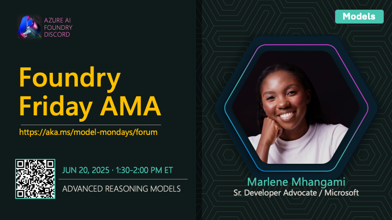

---
date:
    created: 2025-06-16
draft:
    true
authors: 
  - sharda
categories:
  - Recaps
  - Season-02
tags:
  - reasoning, deepseekR, langraph
---

# S2E01 Recap: Advanced Reasoning Session

> Hello, I'm Sharda, a Gold Microsoft Learn Student Ambassador interested in cloud and AI. You can learn more about my technical background on [GitHub]() and follow my blogging journey on [dev.to]() and [Tech Community](). In _this blog series_ I'll summarize my takeaways from this week's [Model Mondays](https://aka.ms/model-mondays/playlist) livestream and leave you with some resources to explore the topic yourself!

---

## About Model Mondays

Model Mondays is a weekly series to help you build your model IQ in three steps:
1. Catch the 5-min Highlights on Monday, to get up to speed on model news
2. Catch the 15-min Spotlight on Monday, for a deep-dive into a model or tool
3. Catch the 30-min AMA on Friday, for a Q&A session with subject matter experts

**Want to follow along?**

  - [**Register Here**](https://aka.ms/model-mondays/rsvp) - to watch upcoming livestreams for Season 2
  - [**Visit The Forum**](https://github.com/orgs/azure-ai-foundry/discussions/54) - to see the full AMA schedule for Season 2
  - [**Register Here**](hhttps://discord.com/invite/azureaifoundry?event=1382860017660854372) - to join the AMA on Friday Jun 20

## Spotlight On: Advanced Reasoning

This week, the Model Mondays spotlight was on **Advanced Reasoning** with subject matter expert Marlene Mhangami. In this blog post, I'll talk about my five takeaways from this episode:

- Why Are Reasoning Models Important?
- What Is an Advanced Reasoning Scenario?
- How Can I Get Started with Reasoning Models  ?
- Spotlight: My Aha Moment
- Highlights: What’s New in Azure AI

---

## 1. Why Are Reasoning Models Important?

In today's fast-evolving AI landscape, it's no longer enough for models to just complete text or summarize content. We need AI that can:

- Understand multi-step tasks  
- Make decisions based on logic  
- Plan sequences of actions or queries  
- Connect context across turns  

Reasoning models are large language models (LLMs) trained with reinforcement learning techniques to "think" before they answer. Rather than simply generating a response based on probability, these models follow an internal thought process producing a chain of reasoning before responding. 

This makes them ideal for complex problem-solving tasks. And they’re the foundation of building intelligent, context-aware agents. They enable next-gen AI workflows in everything from customer support to legal research and healthcare diagnostics.

**Reason:** They allow AI to go beyond surface-level response and deliver solutions that reflect understanding, not just language patterning.

## 2. What does Advanced Reasoning involve?

An advanced reasoning scenario is one where a model:

- Breaks a complex prompt into smaller steps  
- Retrieves relevant external data  
- Uses logic to connect dots  
- Outputs a structured, reasoned answer  

**Example:**  A user asks: “What are the financial and operational risks of expanding a startup to Southeast Asia in 2025?”. This is the kind of question that requires extensive research and analysis.

A reasoning model might tackle this by:
- Retrieving reports on Southeast Asia market conditions  
- Breaking down risks into financial, political, and operational buckets  
- Cross-referencing data with recent trends  
- Returning a reasoned, multi-part answer  

---

## 3. How Can I Get Started with Reasoning Models?

To get started, you need to visit a _catalog_ that has examples of these models. 

1. [Try the GitHub Models Marketplace](https://github.com/marketplace/models) and look for the _reasoning_ category in the filter.
1. [Try the Azure AI Foundry model catalog](https://ai.azure/com/explore/models) and look for reasoning models by name. Example:
    - The _o-series_ of models from Azure Open AI
    - The _DeepSeek-R1_ models
    - The _Grok 3_ models 
    - The _Phi-4 reasoning_ models

**Next, you can use SDKs or Playground** for exploring the model capabiliies.

1. [Try Lab 331](https://aka.ms/build/lab331) - for a beginner-friendly guide.
2. [Try Lab 333](https://aka.ms/discuss/build25-lab333) - for an advanced project.
3. [Try the GitHub Model Playground](https://github.com/marketplace/models) - to compare reasoning and GPT models.
4. [Try the Deep Research Agent using LangChain](https://github.com/Azure-Samples/deepresearch) sample as a great starting project.

Have questions or comments? [Join the Friday AMA](https://aka.ms/model-mondays/chat) on Azure AI FOundry Discord:

---

## 4. **Spotlight**: My Aha Moment

Before this session, I thought reasoning meant longer or more detailed responses. But this session helped me realize that **reasoning means structured thinking** — models now plan, retrieve, and respond with logic.

This inspired me to think about building AI agents that go beyond "chat" and actually assist users like a teammate. It also made me want to dive deeper into LangChain + Azure AI workflows to build mini-agents for real-world use.

---

## 5.**Highlights:** What’s New in Azure AI

Here’s what’s new in the Azure AI Foundry:

- **Direct From Azure Models** - Try hosted models like OpenAI GPT on PTU plans
- **SORA Video Playground**  - Generate video from prompts via SORA models
- **Grok 3 Models** - Now available for secure, scalable LLM experiences
- **DeepSeek R1-0528** - A reasoning-optimized, Microsoft-tuned open-source model

These are all available in the [Azure Model Catalog](https://ai.azure.com/explore/models) and can be tried with your Azure account.

---

## 💡 | Did You Know? 

Your first step is to find the right model for your task. But what if you could have the model _automatically selected for you_ based on the prompt you provide? 

That's the magic of **Model Router** - a deployable AI chat model that dynamically selects the best LLM based on your prompt. Instead of choosing one model manually, the Router makes that choice in real time. _Currently, this works with a fixed set of Azure OpenAI models, including a reasoning model option. Keep an eye on the documentation for more updates_.

**Why it’s powerful:**
- Saves cost by switching between models based on complexity  
- Optimizes performance by selecting the right model for the task
- Lets you test and compare model outputs quickly  

Try it out in **Azure AI Foundry** or read more in the [Model Catalog](https://ai.azure.com/explore/models).

---

## Coming Up Next

Next week, we dive into **Model Context Protocol**, an open protocol that empowers agentic AI applications by making it easier to discover and integrate knowledge and action tools with your model choices. [**Register Here**](https://aka.ms/model-mondays/rsvp) to get reminded - and join us live on Monday!

## 👉🏽👉🏽 Join The Community

Great devs don't build alone! In a fast-pased developer ecosystem, there's no time to hunt for help. That's why we have the Azure AI Developer Community. Join us today and let's journey together!

1. [Join the Discord](https://aka.ms/model-mondays/discord) - for real-time chats, events & learning
1. [Explore the Forum](https://aka.ms/model-mondays/forum) - for AMA recaps, Q&A, and help!

---

