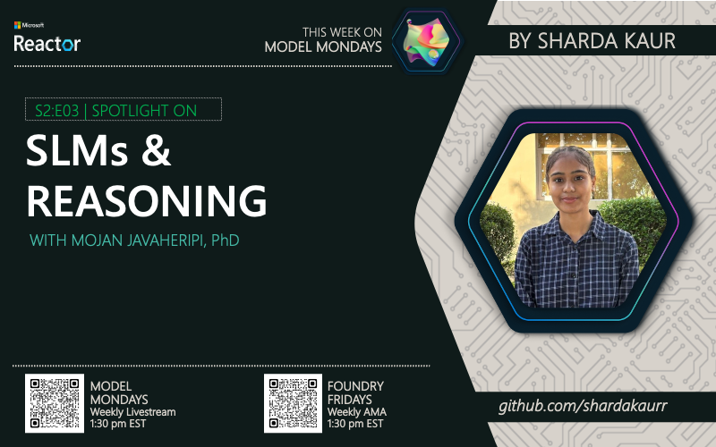

---
date:
    created: 2025-06-30
draft: false
authors: 
  - sharda
  - nitya
categories:
  - Recaps
  - Season-02
tags:
  - slms, reasoning, phi-4
---

# S2:E3 Understanding SLMs and Reasoning with Mojan Javaheripi

> Model Mondays is a weekly series to build your Azure AI Foundry Model IQ. In this episode, we focus on SLMs and Reasoning — and learn how reasoning models leverage inference-time scaling to execute complex tasks in resource-constrained devices with Phi-4 reasoning models.

_This week in Model Mondays, we focus on SLMs and Reasoning — and learn how reasoning models leverage inference-time scaling to execute complex tasks, but how can we use these in resource-constrained devices? Read on for my recap of Mojan Javaheripi's insights on Phi-4 reasoning models that are redefining small language models (SLM) for the agentic era of apps._

 

_This post was generated with AI help and human revision & review. To learn more about our motivation and workflows, please refer to [this document](https://github.com/microsoft/model-mondays/blob/main/docs/README.ai.md) in our website._

### About Model Mondays

Model Mondays is a weekly series designed to help you build your Azure AI Foundry Model IQ step by step. Here's how it works:

- 5-Minute Highlights – Quick news and updates about Azure AI models and tools on Monday
- 15-Minute Spotlight – Deep dive into a key model, protocol, or feature on Monday
- 30-Minute AMA on Friday – Live Q&A with subject matter experts from Monday livestream

If you want to grow your skills with the latest in AI model development, [Model Mondays](https://aka.ms/model-mondays) is the place to start. Want to follow along?

- [Register Here](https://developer.microsoft.com/en-us/reactor/series/S-1485/?wt.mc_id=studentamb_263805) - to watch upcoming Model Monday livestreams 
- [Watch Playlists](https://aka.ms/model-mondays/playlist) to replay past Model Monday episodes 
- [Register Here](https://discord.gg/azureaifoundry?event=1382861149288005693?wt.mc_id=studentamb_263805) - to join the AMA on SLMs and Reasoning on Friday Jul 03
- [Visit The Forum](https://github.com/orgs/azure-ai-foundry/discussions/76?wt.mc_id=studentamb_263805) - to view Foundry Friday AMAs and recaps

 

## Spotlight On: SLMs and Reasoning

### 1. What is this topic and why is it important?

Small Language Models (SLMs) like Phi-4 represent a breakthrough in making advanced reasoning capabilities accessible on resource-constrained devices. While large language models require massive computational resources, SLMs can deliver sophisticated reasoning while running on edge devices, mobile phones, and local hardware. This is crucial because it democratizes AI access, reduces latency, and enables privacy-preserving applications where data doesn't need to leave the device.

Reasoning models use inference-time scaling, meaning they can "think" longer about complex problems to arrive at better solutions. Phi-4 specifically excels at mathematical reasoning, code generation, and logical problem-solving while maintaining a smaller footprint than traditional large models.

### 2. What is one key takeaway from the episode?

The key insight is that Phi-4 proves that model size doesn't always correlate with reasoning capability. Through advanced training techniques and architectural improvements, SLMs can achieve reasoning performance that rivals much larger models while being practical for deployment in real-world, resource-constrained environments. This opens up entirely new possibilities for agentic applications that can run locally and respond quickly.

### 3. How can I get started?

To get started with SLMs and reasoning:
1. Explore Phi-4 on Azure AI Foundry Model Catalog
2. Try the reasoning capabilities in Azure AI Foundry Playground
3. Download and experiment with Phi-4 for local development
4. Check out the sample applications and use cases in the Azure AI Foundry documentation

### 4. What's new in Azure AI Foundry?

Azure AI Foundry continues to evolve to support the growing ecosystem of Small Language Models and agentic apps. Recently, new capabilities have been added to make it easier to fine-tune SLMs like Phi-4 directly in Azure AI Studio. Updates include:

1. Enhanced Model Catalog: Easier discovery of SLMs, reasoning models, and multi-modal models.

2. Improved Prompt Flow Integration: Now with templates specifically designed for SLM-based reasoning tasks.

3. New Evaluation Tools: Built-in model comparison dashboards to quickly test reasoning performance across different SLM variants.

4. Edge Deployment Support: Simplified workflows for packaging and deploying SLMs to local devices and edge environments.
 

## My A-Ha Moment

The biggest Aha moment for me was realizing that a model doesn’t need to be huge to be smart. Phi-4 proved that small models can actually handle complex reasoning tasks just like big models.

What really clicked for me:

1. You don’t need heavy GPUs or cloud servers. These models can run on mobile phones, edge devices, or small local machines.

2. Your data stays on your device, which is great for privacy and faster responses.

3. It’s a total game changer because now we can build intelligent apps that work even on low-resource devices.

 

## Coming up Next Week

Next week, we dive into AI Developer Experiences with Leo Yao. We'll explore how to streamline the AI developer journey from model selection and usage to evaluation and app deployment using the AI Toolkit and Azure AI Foundry extensions for Visual Studio Code. Discover the key capabilities they provide for generative AI app & agent development. [Register Here!](https://developer.microsoft.com/en-us/reactor/events/26108/)

 

## Join The Community
Great devs don't build alone! In a fast-paced developer ecosystem, there's no time to hunt for help. That's why we have the Azure AI Developer Community. Join us today and let's journey together!

1. [Join the Discord](https://discord.com/invite/QR3kaErCRx?wt.mc_id=studentamb_263805) - for real-time chats, events & learning
2. [Explore the Forum](https://github.com/orgs/azure-ai-foundry/discussions/76?wt.mc_id=studentamb_263805) - for AMA recaps, Q&A, and help!

 
 
## About Me:
Hello, I'm Sharda, a Gold Microsoft Learn Student Ambassador interested in cloud and AI. You can learn more about my technical background on [GitHub](https://github.com/shardakaurr) and follow my blogging journey on [dev.to](https://dev.to/sharda_kaur), [linkedin](https://www.linkedin.com/in/sharda-kaur-a77473207/) and [Tech Community](https://techcommunity.microsoft.com/users/sharda_kaur/2204790). In _this blog series_ I'll summarize my takeaways from this week's [Model Mondays](https://aka.ms/model-mondays/playlist) livestream and leave you with some resources to explore the topic yourself!

