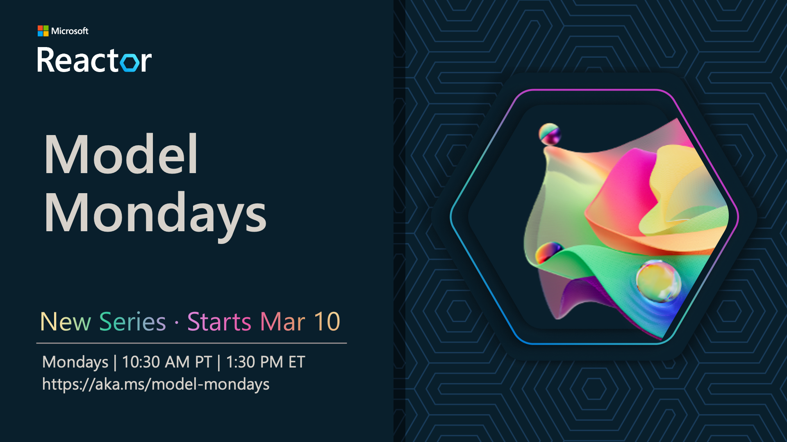

---
hide:
  - navigation

---

# Build Your Model IQ!

## Motivation

Is the pace of AI model evolution leaving you feeling a bit overwhelmed? You aren't alone. The [Azure AI Foundry model catalog](https://ai.azure.com/explore/models) has **over 1800 models** to choose from - and you can find **over 1.5M open-source community variants** on Hugging Face. So - how do you keep up with the news, and build hands-on expertise with this fast-paced ecosystem? Say hello to Model Mondays!

!!! success "BUILD YOUR MODEL IQ ONE WEEK AT A TIME!" 

    1. **Model Mondays** · Watch the livestream Mondays at 1:30pm ET · [**RSVP HERE**](https://aka.ms/model-mondays/RSVP) for upcoming episodes.
    1. **Follow-up Fridays** · Join office hours Fridays at 1:30pm ET · [**ACCEPT INVITE**](https://aka.ms/model-mondays/chat) for a timely reminder.

---

## Watch Last Episode 🆕

Model Mondays is a weekly 30-minute livestream series that helps you keep track of the fast-paced growth of the AI models ecosystem in actionable ways. Every episode is structured in three parts:

- **Model Highlights** - We roundup a week's worth of news in 5 minutes!
- **Model Spotlight** - We dive deeper into one featured model a week!
- **Community Chat** - Join us for office hours on Discord!

!!! task "CATCHUP WITH THE LAST EPISODE"

    <iframe width="100%" height="600" src="https://www.youtube.com/embed/dohvGc7eyqU?list=PLmsFUfdnGr3wzz6a4E-Szksg92JPng-AL" title="Model Mondays – Hands On With GitHub Models" frameborder="0" allow="accelerometer; autoplay; clipboard-write; encrypted-media; gyroscope; picture-in-picture; web-share" referrerpolicy="strict-origin-when-cross-origin" allowfullscreen></iframe>

---

## Season 1: Schedule

In Season 1, we're putting the spotlight on popular models and themes that are gaining traction in the AI Engineering ecosystem. Check out the schedule below **and RSVP now** to get timely reminders to watch.

| Episode Page | Date | Video | Details | Resources | Office Hours |
|:---|:---|:---|:---|:---|:---|
| #01 - GitHub Models | [Mar 10](https://developer.microsoft.com/en-us/reactor/events/25265/) | [**Watch Now**](https://youtu.be/dohvGc7eyqU)| [GitHub Models](./season-01/ep-01.md) | [PDF](https://speakerdeck.com/nitya/model-mondays-s1-e1-mar-10-2025) · Code | [Mar 14](https://aka.ms/model-mondays/chat) |
| #02 - Reasoning Models| Mar 17 | [**RSVP Now**](https://developer.microsoft.com/en-us/reactor/events/25266/) | [OpenAI, DeepSeek](./season-01/ep-02.md)| - | [Mar 21](https://aka.ms/model-mondays/chat) |
| #03 - Search & Retrieval | Mar 24 |  [**RSVP Now**](https://developer.microsoft.com/en-us/reactor/events/25354/) |[Cohere Rerank](./season-01/ep-03.md) | - | [Mar 28](https://aka.ms/model-mondays/chat) |
| #04 - Visual Generative AI | Mar 31 |[**RSVP Now**](https://developer.microsoft.com/en-us/reactor/events/25355/) |[Stable Diffusion](./season-01/ep-04.md) |  - | [Apr 03](https://aka.ms/model-mondays/chat) |
| #05 - Fine-Tuning Models | Apr 07 |[**RSVP Now**](https://developer.microsoft.com/en-us/reactor/events/25356/)  |[TBA](./season-01/ep-05.md) | - |  [Apr 10](https://aka.ms/model-mondays/chat) |
| #06 - Synthetic Datasets | Apr 14 |[**RSVP Now**](https://developer.microsoft.com/en-us/reactor/events/25357/)  |[TBA](./season-01/ep-06.md) | - | [Apr 17](https://aka.ms/model-mondays/chat) |
| #07 - Open Source Projects | Apr 21 |[**RSVP Now**](https://developer.microsoft.com/en-us/reactor/events/25358/)  |[TBA](./season-01/ep-07.md) | - | [Apr 21](https://aka.ms/model-mondays/chat) |
| #08 - Forecasting Models | Apr 28 |[**RSVP Now**](https://developer.microsoft.com/en-us/reactor/events/25359/)  |[Nixtla TimeGEN](./season-01/ep-08.md) | - | [Apr 28](https://aka.ms/model-mondays/chat) |

---

!!! quote "MODEL MONDAYS: Build Your Model IQ" 

    

