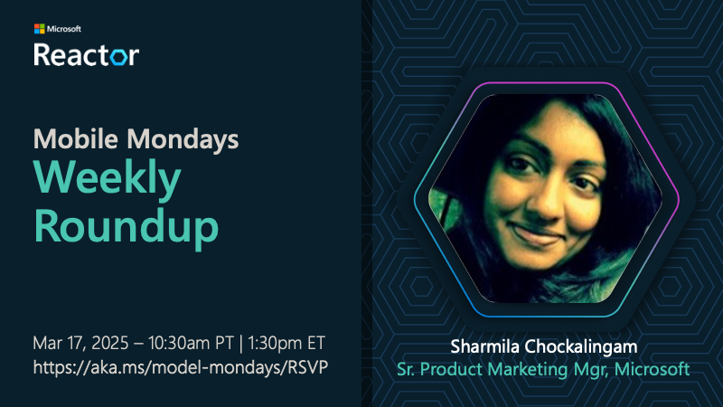
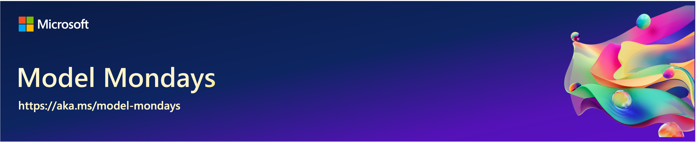

# S1:E1 - Hands on With GitHub Models

> [!IMPORTANT]  
> [Watch The Recording](https://developer.microsoft.com/en-us/reactor/events/25266/)!  
> Model Mondays will be livestreamed every Monday from 1:30pm-2:00pm EST. Register for upcoming episodes at [this link](https://aka.ms/model-mondays/rsvp) 

Welcome to the kickoff episode of Model Mondays. 
In this kickoff episode, we’ll introduce our episode format and get started with our first spotlight segment!

## Weekly Highlights

In this weekly segment, we round up 5 news items of interest to AI engineers, with an emphasis on new models or model-related announcements that caught our attention.

**Click the image to watch that segment**:

**Explore the 5 Links Shared This Week**:

1. [Empowering innovation: the next generation of the Phi family](https://azure.microsoft.com//blog/empowering-innovation-the-next-generation-of-the-phi-family/) 
1. [Introducing Azure AI Foundry Labs: A hub for the latest AI research and experiments at Microsoft](https://azure.microsoft.com/en-us/blog/introducing-azure-ai-foundry-labs-a-hub-for-the-latest-ai-research-and-experiments-at-microsoft)
1. [Better Search, Smarter AI: Cohere Rerank v3.5](https://techcommunity.microsoft.com/blog/machinelearningblog/better-search-smarter-ai-cohere-rerank-v3-5-launches-on-azure-ai-foundry/4386392)
1. [Announcing DeepSeek-V3 on Azure AI Foundry and GitHub](https://techcommunity.microsoft.com/blog/machinelearningblog/announcing-deepseek-v3-on-azure-ai-foundry-and-github/4390438)
1. [Introducing Stability AI Generative Visual Models to Azure AI Foundry
](https://techcommunity.microsoft.com/blog/machinelearningblog/introducing-stability-ai-generative-visual-models-to-azure-ai-foundry/4377271)

## Weekly Spotlight

In this segment, we put the focus on a single model, model family or model feature - and look at it hands-on with code and demos, to get a better intuition for how it works, and where to use it.

**Click the image to watch that segment**:

By the end of this segment you should know:

1. What GitHub Models are, and why they matter.
1. How to get started with your first GitHub Model.
1. How to compare models for evaluating responses.
1. How to go from catalog (explore) to code (develop)
1. How to use Azure Inference API for easy model swap

## Explore the Code!

In this segment, we made use of two resources:

1. [The GitHub Marketplace](https://github.com/marketplace/models) - UI-first approach
1. [The GitHub Codespaces-Models repo](https://github.com/github/codespaces-models) - code-first approach

Check back later for an updated section of _this_ repository where you can try these out interactively, with instructions.

## Continue the Discussion

Join us on [the Azure AI Discord](https://aka.ms/model-mondays/discord) every Friday for _office hours_ where we encourage the community to "show and tell" us what you've been building, with AI models. Plus, _watercooler_ conversations on what has captured our attention this week!

## Spotlight Resources

Check back to see the core resources shared by our speakers, to help you continue your learning journey with GitHub Models.

1. [The GitHub Models Marketplace](https://github.com/marketplace/models) - browser-based playground
1. [The GitHub Models Codespaces Template](https://github.com/github/codespaces-models) - hands-on labs
1. [The GitHub Models Documentation](https://docs.github.com/en/github-models) - prompt editor to CLI
1. [Azure AI Foundry Model Catalog](https://ai.azure.com/explore/models) - 1800+ models to choose from
1. [Azure AI Model Inference API](https://learn.microsoft.com/en-us/azure/machine-learning/reference-model-inference-api?view=azureml-api-2&tabs=python) - unified API for model interaction

---