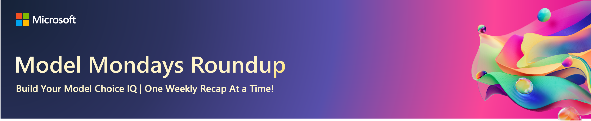

# S1:E3 - Hands on With Search & Retrieval

> [!IMPORTANT]  
> [Watch The Livestream](https://developer.microsoft.com/en-us/reactor/events/25354/)!  
> Model Mondays will be livestreamed every Monday from 1:30pm-2:00pm EST. Register for upcoming episodes at [this link](https://aka.ms/model-mondays/rsvp) 

In this episode, we’ll dive into the fascinating world of _Search & Retrieval Models_ with Neel Gokhale of Cohere!
# Weekly Highlights

In this weekly segment, we round up 5 news items of interest to AI engineers, with an emphasis on new models or model-related announcements that caught our attention.

**Tune in to watch this segment**:

**Check back for the 5 links shared this week**:

1. 
1.
1.
1.
1.

## Weekly Spotlight

In this segment, we put the focus on a single model, model family or model feature - and look at it hands-on with code and demos, to get a better intuition for how it works, and where to use it.

**Tune in to watch this segment**:

## Continue the Discussion

Join us on [the Azure AI Discord](https://aka.ms/model-mondays/discord) every Friday for _office hours_ where we encourage the community to "show and tell" us what you've been building, with AI models. Plus, _watercooler_ conversations on what has captured our attention this week!

## Spotlight Resources

Check back to see the core resources shared by our speakers, to help you continue your learning journey with GitHub Models.
