# Model Mondays: Season 2

This is the currently-planned schedule. Some of the events (see: ⁉️) are currently being planned so please check back regularly for updates!

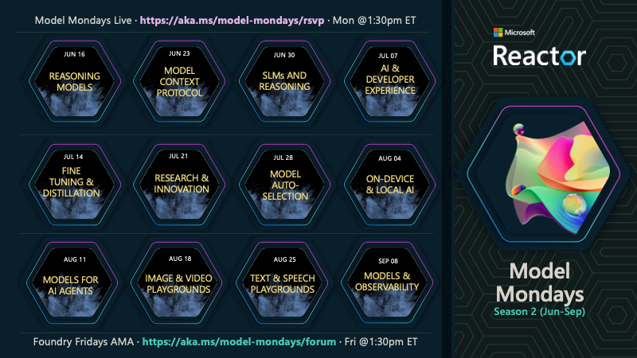

---

  

## S2E01 · Advanced Reasoning

> Want to learn advanced techniques to improve AI's reasoning and problem-solving skills, enabling smarter and more efficient decision-making? Join us as we talk to Marlene Mhangami about her work building a Deep Researcher using Deep Seek R1 and LangChain. 

 - 1️⃣ | [Register For The Livestream](https://developer.microsoft.com/en-us/reactor/events/25905/) - Monday, Jun 16
 - 2️⃣ | [Register For The AMA](https://discord.gg/azureaifoundry?event=1382860017660854372) - Friday, Jun 20
 - 3️⃣ | [Ask Questions & View Recaps](https://github.com/orgs/azure-ai-foundry/discussions/55) - Discussion Forum
 - 4️⃣ | [Download Slides](https://speakerdeck.com/nitya/model-mondays-s2e01-advanced-reasoning) - Speakerdeck PDF

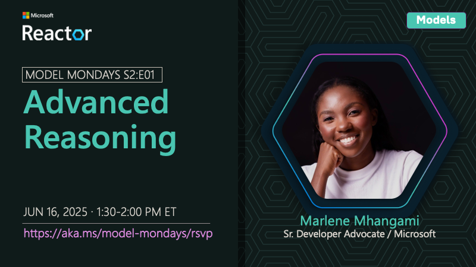

---

## S2E02 · Model Context Protocol

> Want to learn how Model Context Protocol works and how to leverage MCP in a more effective way to extend the capabilities of your AI models and agents? Join us as we talk to Den Delimarsky about the MCP specification, security considerations and usage within Microsoft Azure. 

 - 1️⃣ | [Register For The Livestream](https://developer.microsoft.com/en-us/reactor/events/25906/) - Monday, Jun 23
 - 2️⃣ | [Register For The AMA](https://discord.gg/azureaifoundry?event=1382860621137317948) - Friday, Jun 30
 - 3️⃣ | [Ask Questions & View Recaps](https://github.com/orgs/azure-ai-foundry/discussions/54) - Discussion Forum
 - 4️⃣ | [Download Slides](https://speakerdeck.com/nitya/model-mondays-s2e02-model-context-protocol) - Speakerdeck PDF

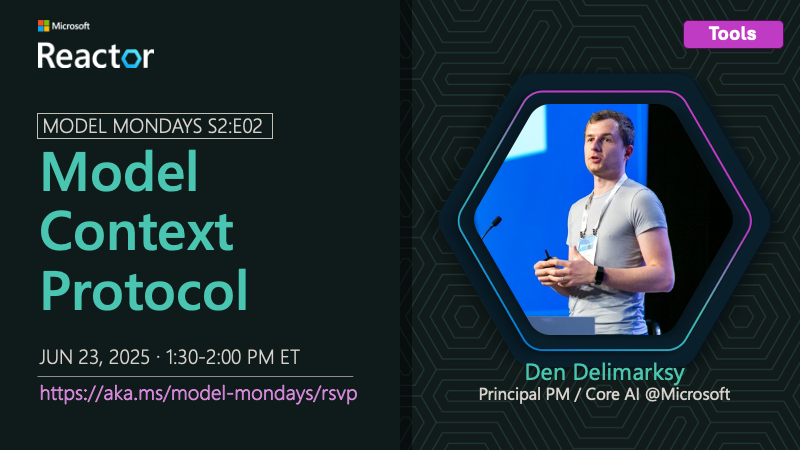

---

## S2E03 · SLMs and Reasoning

> Reasoning models leverage inference-time scaling to execute complex tasks, but how can we use these in resource-constrained devices? Join us as we talk to Mojan Javaheripi about Phi-4 reasoning models that are redefining small language models (SLM) for the agentic era of apps. 

 - 1️⃣ | [Register For The Livestream](https://developer.microsoft.com/en-us/reactor/events/25907/) - Jun 30, 2025
 - 2️⃣ | [Register For The AMA](https://discord.gg/azureaifoundry?event=1382861149288005693) - Jul 03, 2025
 - 3️⃣ | [Ask Questions & View Recaps](https://github.com/orgs/azure-ai-foundry/discussions/76) - Discussion Forum
 - 4️⃣ | [Download Slides](https://speakerdeck.com/nitya/model-mondays-s2e03-slms-and-reasoning) - Speakerdeck 

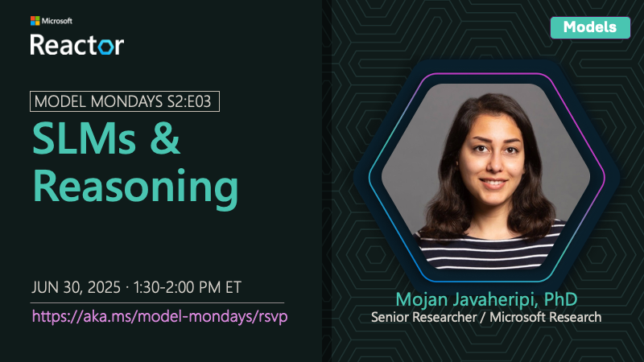

---

## S2E04 · AI Developer Experiences
> How can we streamline the AI developer journey from model selection and usage to evaluation and app deployment? Join us as we talk to Leo Yao about the AI Toolkit and Azure AI Foundry extensions for Visual Studio Code – and the key capabilities they provide for generative AI app & agent development. 

 - 1️⃣ | [Register For The Livestream](https://developer.microsoft.com/en-us/reactor/events/26108/) - Jul 07, 2025
 - 2️⃣ | [Register For The AMA](https://discord.gg/azureaifoundry?event=1382861578201858058) - Jun 11, 2025
 - 3️⃣ | [Ask Questions & View Recaps](https://aka.ms/model-mondays/forum) - Discussion Forum
 - 4️⃣ | [Download Slides](https://speakerdeck.com/nitya/model-mondays-s2e04-ai-developer-experiences) - Speakerdeck PDF

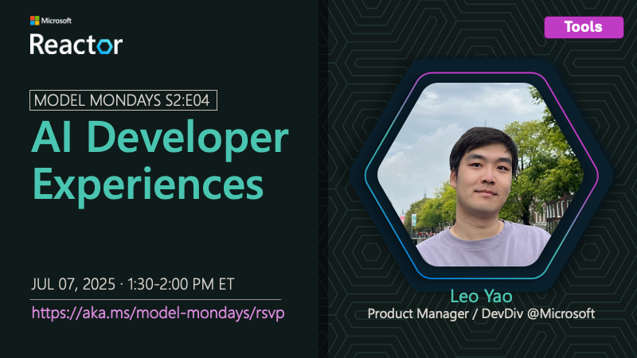

---

## S2E05 · Fine Tuning & Distillation

> Model customization is critical to ensuring the model is optimized for your application requirements. Join us as we talk to Dave Voutila about fine-tuning Azure OpenAI models, using distillation techniques for efficient knowledge transfer, and other best practices in Azure AI Foundry. 

 - 1️⃣ | [Register For The Livestream](https://developer.microsoft.com/en-us/reactor/events/26109/) - Jul 14, 2025
 - 2️⃣ | [Register For The AMA](https://discord.gg/azureaifoundry?event=1382862245721014476) - Jul 18, 2025
 - 3️⃣ | [Ask Questions & View Recaps](https://aka.ms/model-mondays/forum) - Discussion Forum

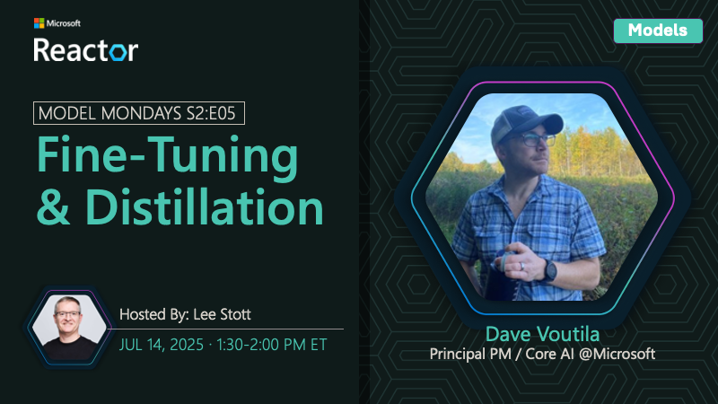

---

## S2E06 · Research & Innovation

### SPOTLIGHT: Foundry Labs

> Azure AI Foundry Labs is a hub to explore cutting-edge research from Microsoft. Join us as we talk to SeokJin Han and Saumil Shrivastava about two key projects – the MCP Server for Azure AI Foundry, and the Magentic-UI for advancing research on human-in-the-loop experiences with AI. We're also joined by Steve Frederickson, Head of Product and Zachary Meierhoffer, Product Manager at Capacity, who walk through how Capacity's Answer Engine uses Azure AI Foundry models to unlock insights from knowledge that exists across their organizations.

 - 1️⃣ | [Register For The Livestream](https://developer.microsoft.com/en-us/reactor/events/26110/) - Jul 21, 2025
 - 2️⃣ | [Register For The AMA](https://discord.gg/D7bAFEwj?event=1382862595849064548) - Jul 25, 2025
 - 3️⃣ | [Ask Questions & View Recaps](https://aka.ms/model-mondays/forum) - Discussion Forum

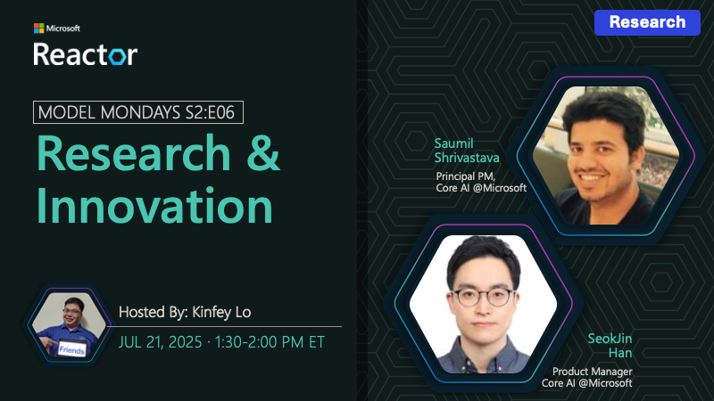

### CUSTOMER STORIES: Capacity

_Join us for this new segment where we talk to customers about real world usage of Azure AI technologies and solutions. We kickoff the first episode with our friends from Capacity!_.

**Speakers:**

_Steve Frederickson_ is Head of Product for Capacity’s Answer Engine, where he leads the strategy and development of AI-powered knowledge solutions. A serial entrepreneur and product innovator, Steve has pioneered Generative AI capabilities since 2021 to reshape how organizations access and use information.

_Zachary Meierhofer_ is a product manager with a passion for turning complex AI into intuitive solutions. At Capacity, he builds tools that help teams access knowledge instantly and deliver smarter support. With over a decade of experience in AI and search, he blends technical depth with a strong focus on user impact.  

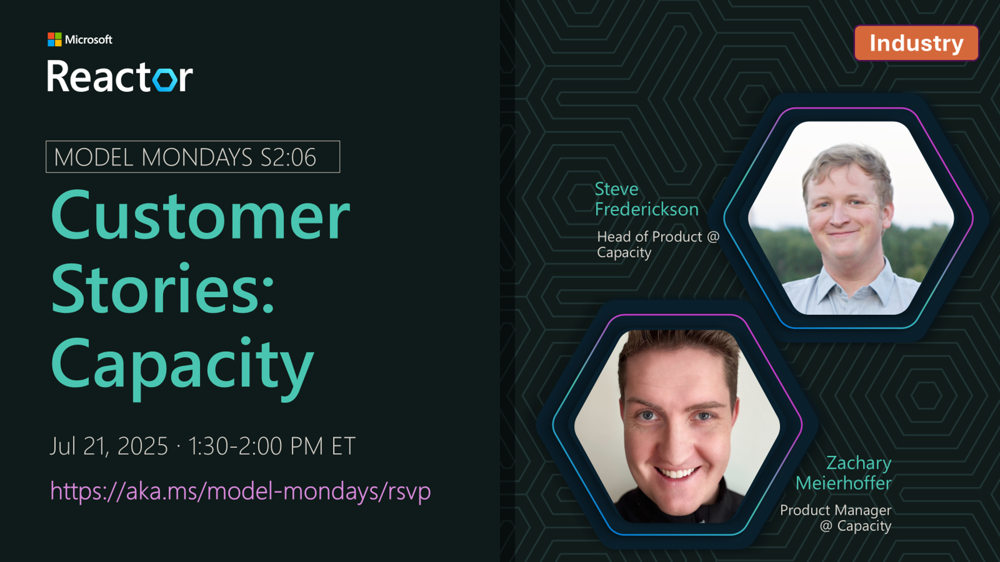

---

## S2E07 · AI-Assisted Azure Development

> Want to bring the power of AI-assisted development to Azure workflows? Join us as we talk to Sandeep Sen about two key tools – the Azure MCP server, and the GitHub Copilot Extension for Azure – that can help you understand, debug & build with Azure resources and services (beyond just Azure AI Foundry) with the power of natural language. We're also joined by Kurt DeMaagd, Chief AI Officer and co-founder at SightMachine, who walks us through how SightMachine's Filler AI streamlines operations on the manufacturing floor using Azure AI Foundry models.

 - 1️⃣ | [Register For The Livestream](https://aka.ms/model-mondays/rsvp) - Jul 28, 2025 ⁉️
 - 2️⃣ | [Register For The AMA](https://aka.ms/model-mondays/chat) - Jul 31, 2025
 - 3️⃣ | [Ask Questions & View Recaps](https://aka.ms/model-mondays/forum) - Discussion Forum

### CUSTOMER STORIES: SightMachine

_In this new segment, we continue talking to customers about real world usage of Azure AI technologies and solutions. In this episode we're joined by Kurt DeMaagd, Chief AI Officer at SightMachine!_.

**Speakers:**

_Kurt DeMaagd_ is is Chief AI Officer and Co-founder at Sight Machine. He has developed AI agents and ML applications for manufacturing predictive maintenance, prescriptive energy optimization and waste reduction, decision support tools for quality, and schedule optimization. Kurt has presented on manufacturing AI/ML at conferences such as the Microsoft Ignite, NVIDIA GTC, Qatar Economic Forum, Automate, the American Society for Quality, multiple presentations at the ASQ Statistic Division conference, plus 30+ academic publications. Previously, Kurt was a professor at Michigan State University. He has a Ph.D. in Business Administration from the University of Michigan, Ross School of Business; and a BS in Computer Science from Hope College..

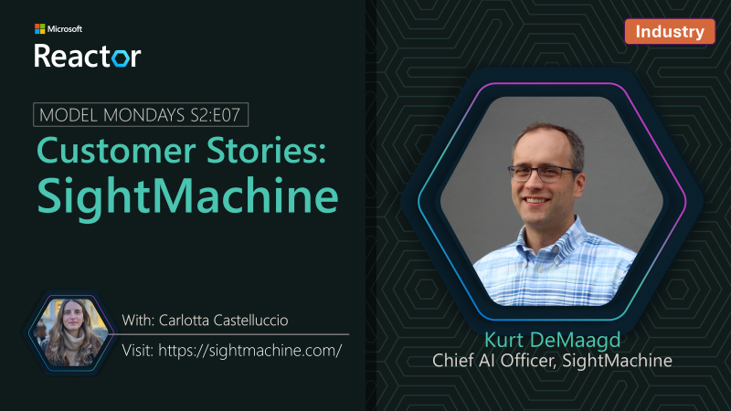
---

## S2E08 · On-Device & Local AI

> On-device inference is critical if you want to run AI models locally, on your own hardware, e.g., for edge computing needs. Join as as we talk to Maanav Dalal about Foundry Local – a solution built on ONNX Runtime (for use in CPUs, NPUs & GPUs) & taking you from prototype to production. 

 - 1️⃣ | [Register For The Livestream](https://developer.microsoft.com/en-us/reactor/events/26127/) - Aug 04, 2025
 - 2️⃣ | [Register For The AMA](https://discord.gg/azureaifoundry?event=1382863345777901670) - Aug 08, 2025
 - 3️⃣ | [Ask Questions & View Recaps](https://aka.ms/model-mondays/forum) - Discussion Forum

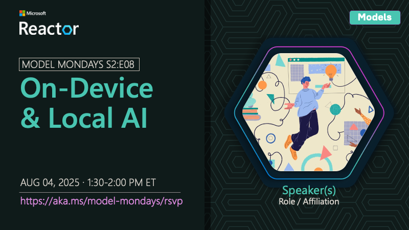

---

## S2E09 · Models for AI Agents

> Want to build agentic AI applications but looking for resources to learn configuration and design patterns? Join as as we talk to Mona Whalin about the Azure AI Foundry Agent Catalog – open-source samples you can explore to accelerate your agent development by integration into projects!

 - 1️⃣ | [Register For The Livestream](https://developer.microsoft.com/en-us/reactor/events/26128/ - Aug 11, 2025
 - 2️⃣ | [Register For The AMA](https://discord.gg/azureaifoundry?event=1382863654961025174) - Aug 15, 2025
 - 3️⃣ | [Ask Questions & View Recaps](https://aka.ms/model-mondays/forum) - Discussion Forum

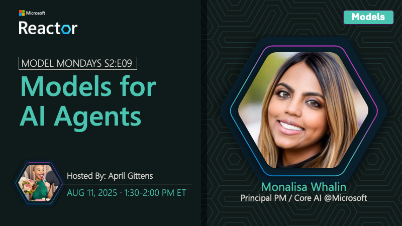

---

## S2E10 · Image & Video Playgrounds

> Want high-fidelity testbeds to prototype visual and video-based generative AI apps with cutting-edge models like Sora and GPT-image-1? Join us as we talk to Thasmika Gokal about going from prompt to playback with Azure AI Foundry Image & Video Playgrounds. 

 - 1️⃣ | [Register For The Livestream](https://developer.microsoft.com/en-us/reactor/events/26129/) - Aug 18, 2025
 - 2️⃣ | [Register For The AMA](https://discord.gg/azureaifoundry?event=1382864122902745228) - Aug 22, 2025
 - 3️⃣ | [Ask Questions & View Recaps](https://aka.ms/model-mondays/forum) - Discussion Forum

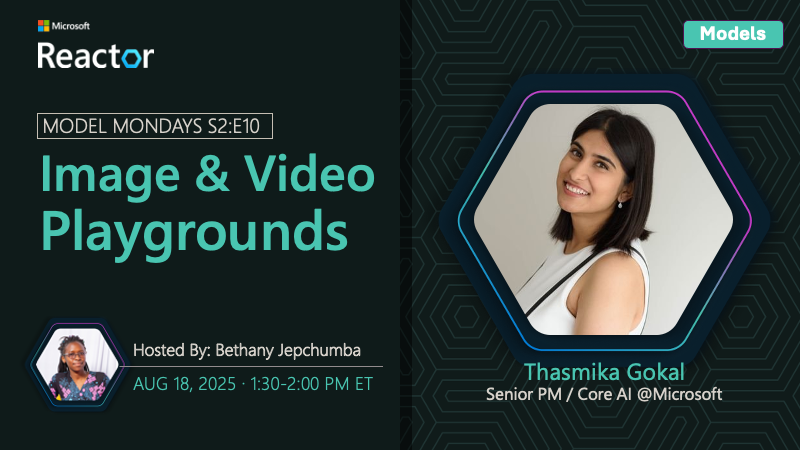

---

## S2E11 · Text & Speech Playgrounds

> Want to explore natural language and speech capabilities (like text to speech, speech to text, translation etc.) in your browser before switching to code? Try the Azure AI Foundry Speech and Language playground. Join us as we talk to Cenyu Zhang about the Speech resource and how we can use it today to transform the user experience in generative AI applications. 

 - 1️⃣ | [Register For The Livestream](URL_TBD) - Aug 25, 2025 ⁉️
 - 2️⃣ | [Register For The AMA](https://discord.gg/azureaifoundry?event=1382864441191960696) - Aug 29, 2025
 - 3️⃣ | [Ask Questions & View Recaps](https://aka.ms/model-mondays/forum) - Discussion Forum

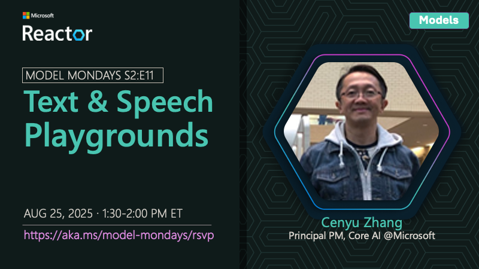

---

## S2E12 · Models & Observability

> Observability is about instrumenting AI apps to collect signals that provide insight into model behavior & performance across the GenAIOps lifecycle. Join us as we talk to Minsoo Thigpen about evaluations, red-teaming & end-to-end observability in Azure AI Foundry – for trustworthy AI! 

 - 1️⃣ | [Register For The Livestream](URL_TBD) - Sep 08, 2025 ⁉️
 - 2️⃣ | [Register For The AMA](https://discord.gg/azureaifoundry?event=1382864811649536120) - Sep 12, 2025
 - 3️⃣ | [Ask Questions & View Recaps](https://aka.ms/model-mondays/forum) - Discussion Forum

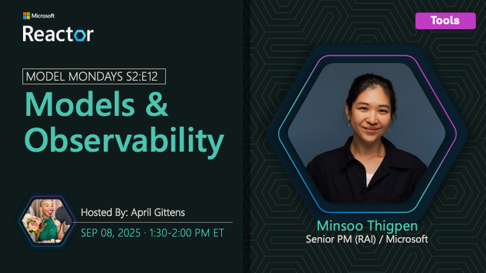

---

## S2E13 · Open Source Models (In-Planning)

> Did you know the Hugging Face collection on Azure AI Foundry Models currently has over 10K options? So when should we use them and how do we select the right one? Join us as we talk about getting started with Hugging Face models on Azure AI – and how you can request new additions. 

 - 1️⃣ | Register For The Livestream - Date TBD ⁉️
 - 2️⃣ | Register For The AMA - Date TBD ⁉️
 - 3️⃣ | Ask Questions & View Recaps - Event TBA⁉️

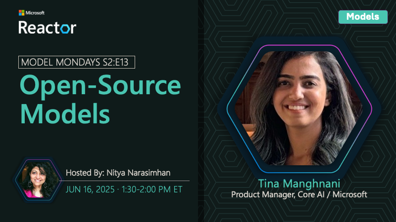

