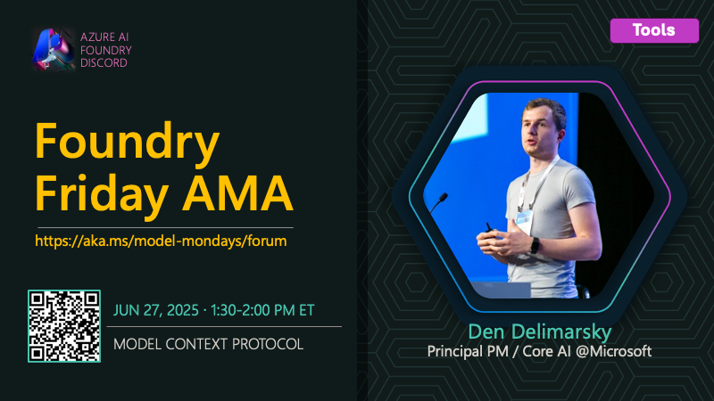

## AMA on Model Context Protocol (MCP)

This is part of the [#ModelMondays](https://aka.ms/model-mondays) series where we put the spotlight on a new model-related topic each week.

🌟🌟 See #54 **for the full Foundry Fridays AMA schedule** 🌟🌟

---

### Event Details

Curious about how to extend your AI models and agents with powerful new capabilities? This session dives into the Model Context Protocol (MCP), an open standard for connecting AI models to external tools and data. Den Delimarsky will walk you through the MCP specification, security best practices, and how MCP is used within Microsoft Azure to build agentic applications. Learn how to consume existing MCP servers, develop your own, and unlock new integration patterns for intelligent apps.

- 1️⃣ | Register for the [Friday AMA](https://discord.gg/azureaifoundry?event=1382860621137317948) - 1:30pm ET
- 2️⃣ | Watch the [Monday Livestream](https://developer.microsoft.com/en-us/reactor/events/25906/) - 1:30pm ET
- 3️⃣ | Learn more [About Model Mondays](https://aka.ms/model-mondays) - Season 1 Recaps + Season 2 Schedule

### Related Resources

- [Build Agents using Model Context Protocol on Azure](https://learn.microsoft.com/en-us/azure/developer/ai/intro-agents-mcp)
- [How to use the Model Context Protocol (MCP) tool](https://learn.microsoft.com/en-us/azure/ai-foundry/agents/how-to/tools/model-context-protocol-samples)
- [Get started with .NET AI and the Model Context Protocol](https://learn.microsoft.com/en-us/dotnet/ai/get-started-mcp)

---

