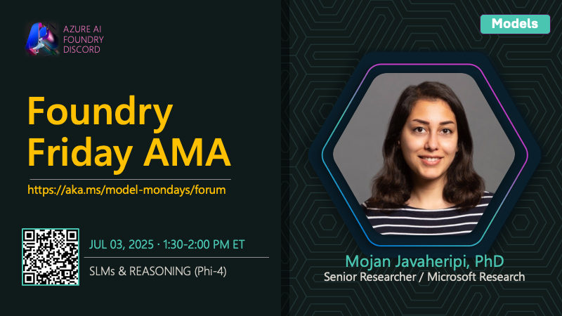

## AMA on SLMs and Reasoning

This is part of the [#ModelMondays](https://aka.ms/model-mondays) series where we put the spotlight on a new model-related topic each week.

🌟🌟 See #54 **for the full Foundry Fridays AMA schedule** 🌟🌟

---

### Event Details

How can you bring advanced reasoning to resource-constrained devices? This session explores the latest in Small Language Models (SLMs) like Phi-4, which are redefining what’s possible for agentic apps. Mojan Javaheripi will discuss how SLMs leverage inference-time scaling and chain-of-thought reasoning to deliver powerful results on smaller hardware. Discover use cases, deployment strategies, and how SLMs are making AI more accessible and efficient for everyone.

- 1️⃣ | Register for the [Friday AMA](https://discord.gg/azureaifoundry?event=1382861149288005693) - 1:30pm ET
- 2️⃣ | Watch the [Monday Livestream](https://developer.microsoft.com/en-us/reactor/events/25907/) - 1:30pm ET
- 3️⃣ | Learn more [About Model Mondays](https://aka.ms/model-mondays) - Season 1 Recaps + Season 2 Schedule

## Related Resources

- [Concepts - Small and large language models](https://learn.microsoft.com/en-us/azure/aks/concepts-ai-ml-language-models#when-to-use-small-language-models)
- [Phi-4 and Phi-4 Reasoning Models in Azure AI Foundry](https://learn.microsoft.com/en-us/azure/ai-foundry/concepts/models-featured#microsoft)
- [How to use reasoning models with Azure AI Foundry](https://learn.microsoft.com/en-us/azure/ai-foundry/foundry-models/how-to/use-chat-reasoning)

---

<!--
Use the Microsoft Docs MCP Server to change the related resources in this file to 3 resources that focus on (1) Small Language Models (2) Phi-4 Models and (3) ReASONING MODELS as the topics
-->
