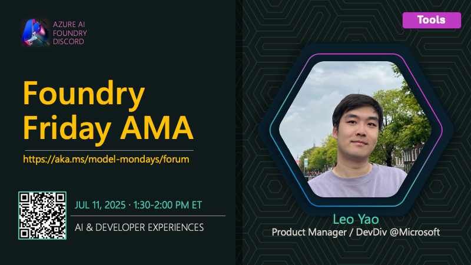

## AMA on AI Developer Experiences

This is part of the [#ModelMondays](https://aka.ms/model-mondays) series where we put the spotlight on a new model-related topic each week.

🌟🌟 See #54 **for the full Foundry Fridays AMA schedule** 🌟🌟

---

### Event Details

Ready to streamline your AI development workflow? This session highlights the latest tools and extensions for building, evaluating, and deploying generative AI apps. Leo Yao will showcase the AI Toolkit and Azure AI Foundry extensions for Visual Studio Code, sharing tips for model selection, agent development, and integrating AI into your projects. Whether you’re new to AI or a seasoned developer, discover how to boost productivity and bring your ideas to life with Microsoft’s developer ecosystem.

- 1️⃣ | Register for the [Friday AMA](https://discord.gg/azureaifoundry?event=1382861578201858058) - 1:30pm ET
- 2️⃣ | Watch the [Monday Livestream](https://developer.microsoft.com/en-us/reactor/events/26108/) - 1:30pm ET
- 3️⃣ | Learn more [About Model Mondays](https://aka.ms/model-mondays) - Season 1 Recaps + Season 2 Schedule

## Related Resources

- [What is the AI Toolkit for Visual Studio Code?](https://learn.microsoft.com/en-us/windows/ai/toolkit/)
- [Work with the Azure AI Foundry for Visual Studio Code extension](https://learn.microsoft.com/en-us/azure/ai-foundry/how-to/develop/get-started-projects-vs-code)
- [Work with Azure AI Foundry Agent Service in Visual Studio Code](https://learn.microsoft.com/en-us/azure/ai-foundry/how-to/develop/vs-code-agents)

---

