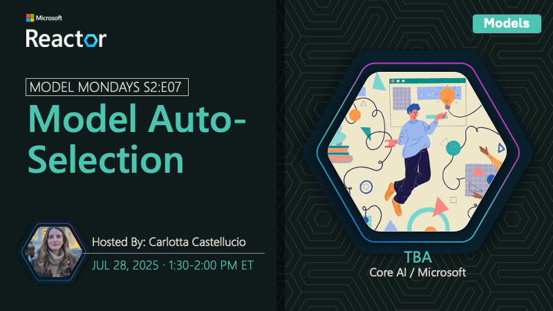

## AMA on AI-Assisted Azure Development

This is part of the [#ModelMondays](https://aka.ms/model-mondays) series where we put the spotlight on a new model-related topic each week.

🌟🌟 See #54 **for the full Foundry Fridays AMA schedule** 🌟🌟

---

### Event Details

Want to bring the power of AI-assisted development to Azure workflows? Join us as we talk to Sandeep Sen about two key tools – the Azure MCP server, and the GitHub Copilot Extension for Azure – that can help you understand, debug & build with Azure resources and services (beyond just Azure AI Foundry) with the power of natural language

- 1️⃣ | Register for the [Friday AMA](https://discord.gg/Z8JZsrP5P5?event=1382864811649536120) - 1:30pm ET
- 2️⃣ | Watch the [Monday Livestream](https://aka.ms/model-mondays/rsvp) - 1:30pm ET
- 3️⃣ | Learn more [About Model Mondays](https://aka.ms/model-mondays) - Season 1 Recaps + Season 2 Schedule

## Related Resources

- [Azure MCP Server](https://github.com/Azure/azure-mcp)
- [Azure MCP Server Documentation](https://learn.microsoft.com/en-us/azure/developer/azure-mcp-server/)
- [GitHub Copilot for Azure](https://learn.microsoft.com/en-us/azure/developer/github-copilot-azure/)

---

