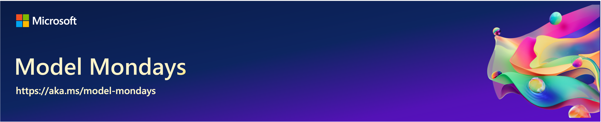

# S1:E1 - Hands on With GitHub Models

> [!IMPORTANT]  
> [Register here and join us live](https://aka.ms/model-mondays/RSVP)!  
> Model Mondays will be livestreamed every Monday from 1:30pm-2:00pm EST on Microsoft Reactor! Season 1 kicks off on March 10 with 8 episodes planned for the first run. 

Then check back later to see relevant resources and a link to the video replay for self-guided learning and exploration in the sections below.

 

## Model Roundup

Check back to learn about the 5 model-related news items that caught our eye this week!

1. 
1.
1.
1.
1. 

 

## Model Spotlight

In this kickoff episode, we’ll set the stage for season 1 by talking about the models we’ll spotlight. Then, we’ll do a deep dive into GitHub Models and show you how you can get started with exploring these hands-on today, with just a GitHub account!

By the end of this episode you should know:
1. What GitHub Models are, and why they matter.
1. How to get started with your first GitHub Model.
1. How to compare models for evaluating responses.
1. How to go from catalog (explore) to code (develop)
1. How to use Azure Inference API for easy model swap

 

## Continue the Discussion

Join us on [the Azure AI Discord](https://aka.ms/model-mondays/discord) every Friday for _office hours_ where we encourage the community to "show and tell" us what you've been building, with AI models. Plus, _watercooler_ conversations on what has captured our attention this week!

 

## Model Resources

Check back to see the core resources shared by our speakers, to help you continue your learning journey with GitHub Models.

1.
1.
1.
1.
1.

---